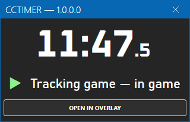
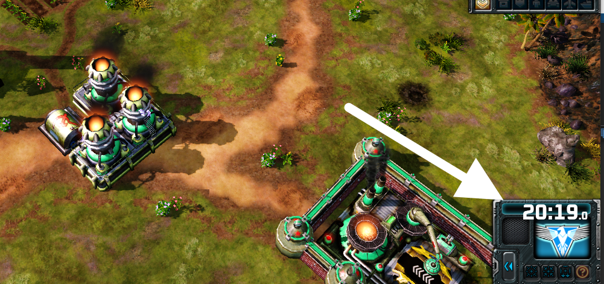

# Command & Conquer Timer Overlay

This application for Windows allows you to see an accurate in-game timer for some Command & Conquer games, synced-up automatically with the game running alongside.

## Supported games

The currently supported games are the following:
- **C&C3: Kane's Wrath** (Steam version)
- **C&C Red Alert 3** (Steam version)

## Features

- Simple UI
- Automatic game detection & synchronization, no user actions required
- Open a transparent window to overlay the timer on top of your game
- Move and resize the overlay freely

## Installation

1. Download the zip of the latest version in the Releases here on GitHub.
2. Extract the zip to any location.
3. Run `CCTimer.exe`. The main window should appear after a few seconds.

## How to use

- The timer on the main window will work right away. When one of the supported games is running, the timer should detect the game automatically and synchronize with it on its own.
- Click the button labeled `Open in overlay` to open a transparent window that you can put on top of your game. The text is white, so if you can't see the timer, it's probably just hidden by a window with a white background.
- Move the overlay window by dragging it over the timer area.
- Close or resize the overlay window by using the tiny buttons that show up when your mouse pointer is over the window.

## Q&A

### Does this work on replays? On live games? What if I am a spectator?
It works on replays as well as on live games, whether you are an active player or a spectator.

### Can I use this when playing online? Is this considered cheating?
As of now, this tool should be considered safe to use for multiplayer games. We believe it does not allow you to gain any exclusive advantage. There has been no known discussion or controversy about it.

### What's the advantage when compared to any other timer software?
The timer synchronizes with the in-game clock. It will be started automatically when a game starts, stopped when a game ends, will properly pause when the game is not running, slow down when the game lags, accelerate on fast-forward in replays, etc.

### How does it work? Is this a mod?
This is not a mod. The game is not modified in any way. The timer tool will only read the memory of the process running the game. It's like a probe running alongside with the game.

## Credits

This tool uses the following third party resources:
- [Mahapps.Metro](https://mahapps.com) by punker76 & contributors, under the MIT license
- [PropertyChanged.SourceGenerator](https://github.com/canton7/PropertyChanged.SourceGenerator) by canton7, under the MIT license
- The [Oxanium font](https://fonts.google.com/specimen/Oxanium) by Severin Meyer, under the Open Font License.